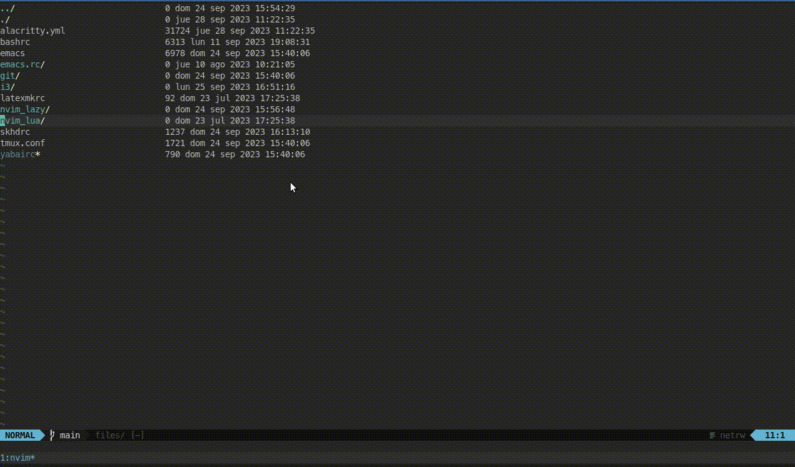

# Whaler


Lost in the ocean of your unordered and unorganized file-explorer looking for that project? Whaler has you covered.


## What is Whaler?

**Whaler** is a [Telescope](https://github.com/nvim-telescope/telescope.nvim) extension to move ~~blazingly~~ fast between directories.

It is based on the concept of [tmux-windowizer](https://github.com/ThePrimeagen/.dotfiles/blob/master/bin/.local/scripts/tmux-windowizer) from [ThePrimeagen](https://github.com/ThePrimeagen) which uses a set of directories and [fzf](https://github.com/junegunn/fzf) to move to another directory in a new tmux session.

**Whaler** offers a fast experience to move between projects without having much hassle.



`Whaler.nvim` does primarily the following things:
1. Looks for subdirectories in a set of directories passed as arguments.
2. Fuzzy finds among the subdirectories.
3. Once a directory is selected it automatically changes the vim `cwd` to the selected directory. (customizable)
4. Automatically opens the desired file explorer.  (customizable)

## Whaler: Table of Contents

- [Getting started](#getting-started)
- [Usage](#usage)
- [Customization](#customization)
- [Use cases](#use-cases)
- [Supported File Explorers](#supported-file-explorers)
- [Related Projects](#related-projects)

## Getting Started

**Whaler** is a neovim telescope plugin extension.

#### Dependencies

- [Neovim (v0.9.0)](https://github.com/neovim/neovim/releases/tag/v0.9.0)
- [Telescope](https://github.com/nvim-telescope/telescope.nvim)

#### Installation guide

It is recommended to put `whaler` as a Telescope dependency.

Using **lazy**:
```lua
return {
    "SalOrak/whaler"
}
```

## Usage

Whaler does not have any **mappings** by default. It is up to you to create any mappings.

In the Telescope configuration file:
```lua
-- Telescope setup()
local telescope = require('telescope')

telescope.setup({
    -- Your telescope setup here...
    extensions = {
        whaler = {
            -- Whaler configuration
            directories = { "path/to/dir", "path/to/another/dir", { path = "path/to/yet/another/dir", alias = "yet" } },
            -- You may also add directories that will not be searched for subdirectories
            oneoff_directories = { "path/to/project/folder",  { path = "path/to/another/project", alias = "Project Z" } },
        }
    }
})
-- More config here
telescope.load_extension("whaler")
--

-- Open whaler using <leader>fw
vim.keymap.set("n", "<leader>fw", function()
    local w = telescope.extensions.whaler.whaler
    w({
        -- Settings can also be called here.
        -- These would use but not change the setup configuration.
    })
 end,)

-- Or directly
vim.keymap.set("n", "<leader>fw", telescope.extensions.whaler.whaler)
```

In addition to passing strings into the `directories` and `oneoff_directories`
parameters above one may also choose to use tables such as
`{path="/path/to/dir", alias="Personal Projects"}`, this will modify the text
presented in the selection UI to show `[Personal Projects] theproject` instead
of the full path to each of the project folders.

Now, pressing `<leader>fw` will open a Telescope picker with the subdirectories of the specified directories for you to select.

## Customization

Whaler supports a few configuration options.
Here is the list of a default configuration:
```lua
whaler = {
    directories = { "/home/user/projects", { path = "/home/user/work", alias = "work" } }, -- Path directories to search. By default the list is empty.
    oneoff_directories = { "/home/user/.config/nvim" }, -- Path directories to append directly to list of projects. By default is empty. 
    auto_file_explorer = true, -- Whether to automatically open file explorer. By default is `true`
    auto_cwd = true, -- Whether to automatically change current working directory. By default is `true`
    file_explorer = "netrw", -- Automagically creates a configuration for the file explorer of your choice. 
                             -- Options are "netrw"(default), "nvimtree", "neotree", "oil", "telescope_file_browser".
    file_explorer_config = { -- (OPTIONAL) Map to configure what command is triggered by which plugin. 
    hidden = false, -- Show hidden directories or not (default false).
    links  = false,  -- Append linked directories or not (default false).
                             -- For basic configuration this is done automatically setting up the file_explorer config.
        plugin_name = "netrw", -- Plugin. Should be installed.
        command = "Explorer", -- The plugin command to open.
                              -- Command must accept a path as parameter
        prefix_dir = " ",     -- Prefix string to be appended after the command and before the directory path. 
                              -- Example: In the `telescope_file_browser` the value is ` path=`.
                              --          The final command is `Telescope file_browser path=/path/to/dir`.
                              -- By default is " " (space)
    },
    theme = {                -- Telescope theme default Whaler options.
        results_title = false, -- Either `false` or a string. 
        layout_strategy = "center",
        previewer = false,
        layout_config = {
            height =  0.3,
            width = 0.4
        },
        sorting_strategy = "ascending",
        border = true,
    } 
}
```
By default `Whaler.nvim` changes the current working directory (*cwd*) to the selected directory AND opens the file explorer (`netrw` by default). 

Changing `auto_cwd` to `false` will make Whaler to only open the file explorer in the selected directory while maintaining the previous current working directory.

Changing `auto_file_explorer` to `false` while keeping `auto_cwd` enabled will make Whaler to change the current working directory to the selected one but without losing the current file. 

**Attention!**: Setting both `auto_cwd` and `auto_file_explorer` to false will make Whaler almost useless as it won't affect to anything.

The `file_explorer` is a shortcut that automatically create a `file_explorer_config` with some basics commands. You can, for example, use the default `netrw` but instead of using `Explore` you can split it using `VExplore`. To do the whaler setup config should be like
```lua
whaler = {
    -- Some config here
    file_explorer_config = {
        plugin_name = "netrw", -- Plugin name.
        command = "Vexplore", -- Vertical file explorer command
        prefix_dir = " ", -- (Optional) By default is space.  
    },
}
```

## Use cases

Here I'll show some few use cases for `Whaler.nvim`.
I'll be adding more but if you have any special use case please let me know and I'll add it here!

#### Split-viewing files from different projects

Using the following **setup**:
```lua
whaler = {
    directories = { "~/work" }, 
    auto_file_explorer = false, -- Do not open file explorer
    auto_cwd = true, -- But change working directory
}
```
Imaging you are starting a new project called **harp** inside your work path (`"/home/user/work"`). This new project it is similar to another already developed project called **Wheel** but with some fundamental changes. You want to compare the starting files side by side. You can enter the **harp** project and open the starting file. Then execute `Whaler.nvim` with the previous configuration setup and select the **Wheel** project. Notice that nothing really changed. But if you now find files in the current directory using `Telescope find_files` it would display ALL the **Wheel** files available. You can then open the desired file in a vertical split (default to `<C-v>` ) and keep modifying the main file in the **harp** project having the developed main **Wheel** side by side.


#### Multiple Whaler use cases

Let's say you want to search for a file in another directory but don't want to change directories again. Whaler can multiple configuration directly. 
The setup dictates the defaults of how Whaler would behave if nothing is passed when executed.
```lua
-- Setup whaler
whaler = {
    directories = { "/home/user/projects", { path = "/home/user/work", alias = "work" } },
    oneoff_directories = { "/home/user/.config/nvim" }, 
    auto_file_explorer = true, 
    auto_cwd = true, 
    file_explorer = "netrw",
    theme = {                -- Telescope theme default Whaler options.
        results_title = false,
        layout_strategy = "center",
        previewer = false,
        layout_config = {
            height =  0.3,
            width = 0.4
        },
        sorting_strategy = "ascending",
        border = true,
    } 
}
```

Now, we configure the keymaps and add a new keymap to run Whaler and instead of changing directories it will run `Telescope find_file`.
```lua
local keymap = vim.keymap
keymap.set("n", "<leader>ww", telescope.extensions.whaler.whaler)
keymap.set("n", "<leader>wn", function()
        local w = telescope.extensions.whaler.whaler
        w({
            auto_file_explorer = true,
            auto_cwd = false,
            file_explorer_config = {
            plugin_name = "telescope",
            command = "Telescope find_files",
            prefix_dir = " cwd=",
            },
            theme = {
                previewer = false,
            },
        })
    end)
        
```
Pressing `<leader>ww` would run Whaler with the setup previously configured, running netrw and changing directories. On the other hand, pressing `<leader>wn` would run Whaler with the new configuration, without changing directories and running `Telescope find_files` in the selected directory.

## Supported File Explorers

Currently the following file explorers are supported out of the box:
- [netrw](): Default and fallback option.
- [Neo-Tree](https://github.com/nvim-neo-tree/neo-tree.nvim). Does not require any configuration.
- [Oil](https://github.com/stevearc/oil.nvim). Does not require any configuration.
- [Nvim-Tree](https://github.com/nvim-tree/nvim-tree.lua). To work as intended add `sync_root_with_cwd = true` in the `nvim-tree` setup function.
- [Telescope-file-browser](https://github.com/nvim-telescope/telescope-file-browser.nvim). Does not require any configuration.


## Related projects

There are MANY file explorers in the neovim community. This is NOT a replacement for any of them but an improvement whilst using Telescope.

But there are many extensions and projects that do relatively the same thing. 

Check them out:
- [telescope-pathogen](https://github.com/brookhong/telescope-pathogen.nvim)
- [telescope-project](https://github.com/nvim-telescope/telescope-project.nvim)
- [telescope-repo](https://github.com/cljoly/telescope-repo.nvim)

You can find more telescope extensions in the [Telescope Extensions Wiki](https://github.com/nvim-telescope/telescope.nvim/wiki/Extensions).

If you use or prefer any other let me know and I'll add them here.

## Credits
Shoutouts to all the great contributrs actively working on `Whaler.nvim` that helped shape the plugin.
- [GCBallesteros](https://github.com/GCBallesteros) - for constantly suggesting and developing Whaler. 


